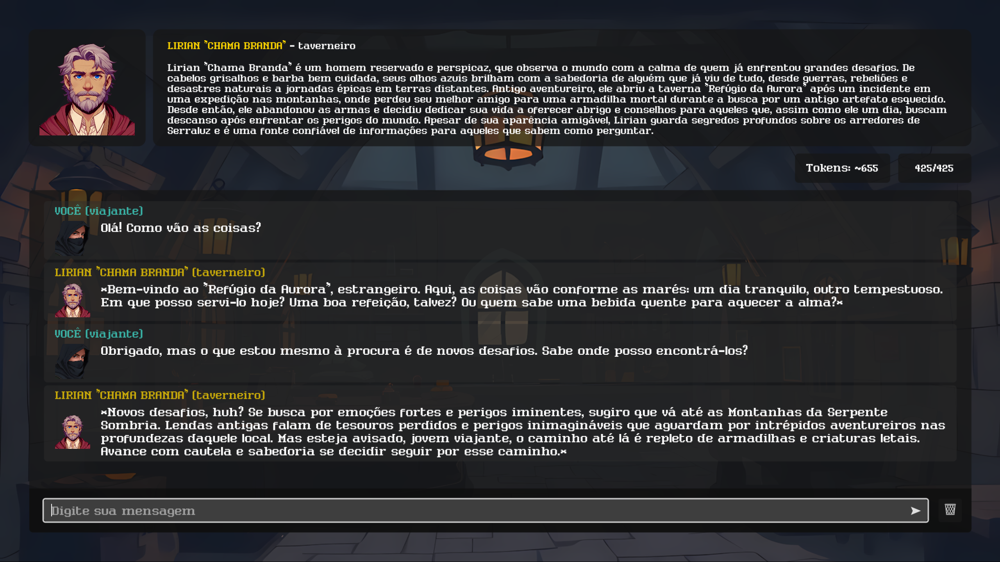

# A Chegada em Serraluz - Tech Demo de RPG baseado em texto com integração com ChatGPT

**A Chegada em Serraluz** é um projeto desenvolvido em Godot 4.3 com o objetivo de demonstrar a implementação de um jogo de RPG baseado em texto com integração com ChatGPT, onde o jogador pode interagir com personagens cujo comportamento e raciocínio são inteiramente determinados pelo ChatGPT, baseados apenas em uma curta descrição e um conjunto de instruções (prompt) simples.

Projeto desenvolvido como parte do Trabalho de Conclusão de Curso (TCC) da Especialização em Tecnologias e Sistemas de Informação da UFABC (2024).

### Screenshots

Demo

## Instalação / Execução

OBS: Os arquivos binários ainda não foram gerados. 
 
Para executar este projeto, siga estas instruções:
1. Instale o Godot Engine: [https://godotengine.org/](https://godotengine.org/)
2. Clone este repositório.
3. Copie o arquivo environment_template.cfg e renomeie-o para environment.cfg
4. Abra o arquivo environment.cfg e substitua o valor da chave "open_api_key" com sua chave de API do OpenAI. Para obter sua chave de API, acesse [https://platform.openai.com/api-keys](https://platform.openai.com/api-keys). Talvez seja necessário criar uma conta e configurar uma forma de pagamento na plataforma da OpenAI.  
⚠️ *OBS: Existem custos associados ao uso da API. Consulte a documentação da OpenAI para obter mais informações.*
5. Abra o Godot Engine, importe o projeto e execute o jogo.

## Licença

O código-fonte deste projeto está sob a licença MIT. Veja o arquivo LICENSE para mais detalhes.

## Créditos

* Pacote de Fontes: [Humble Fonts Gold - somepx](https://somepx.itch.io/humble-fonts-gold)

## Observações
Inclui imagens geradas pelo [DALL-E 3](https://openai.com/index/dall-e-3/)
